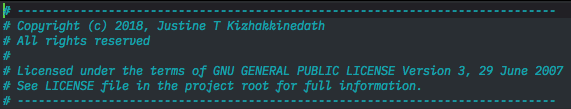
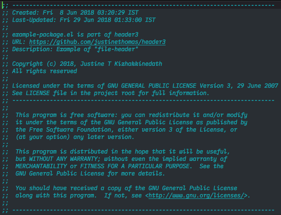
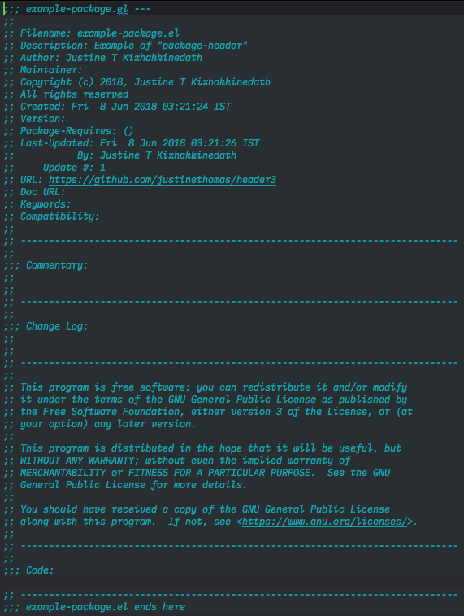
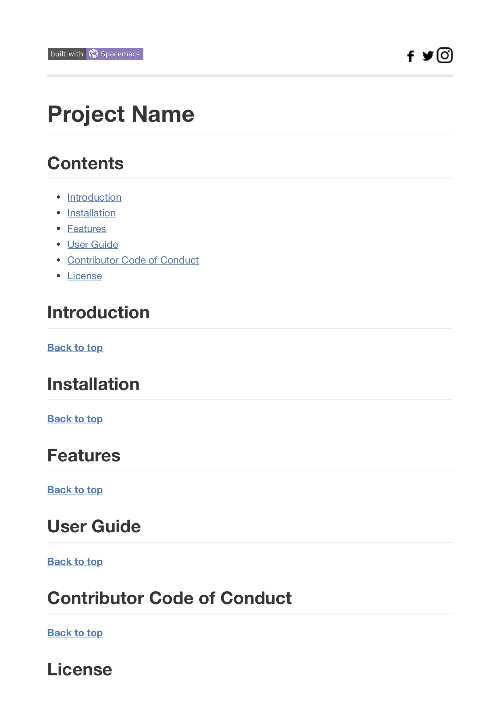
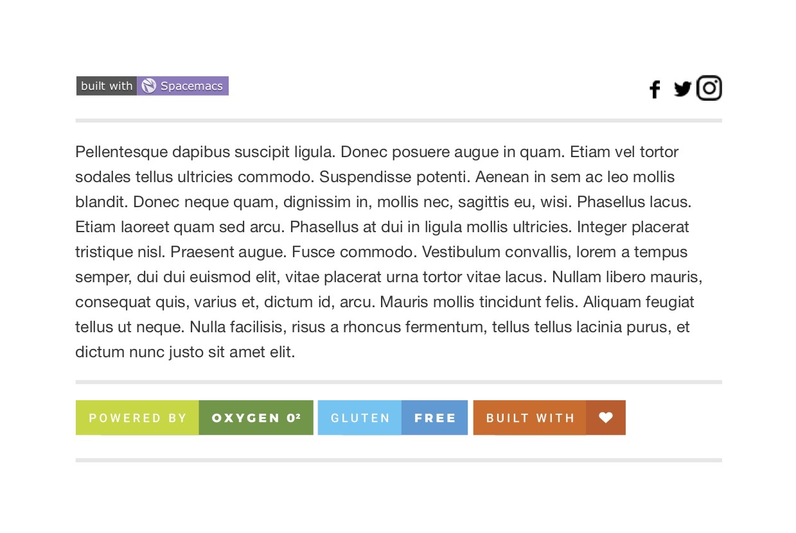

 
- - -

- - -

- - -

- [Introduction](#introduction)
  - [Types of headers](#types-of-headers)
    - [Mini Header](#mini-header)
    - [File Header](#file-header)
    - [Package Header](#package-header)
    - [Readme Header](#readme-header)
      - [Template for new file](#template-for-new-file)
      - [Template for existing file](#template-for-existing-file)
- [Features](#features)
- [Getting Started](#getting-started)
- [Full Documentation](#full-documentation)
  - [Requirements](#requirements)
  - [How to use?](#how-to-use)
- [License](#license)

## Introduction

Header3 is a package for Emacs which will help you to automatically add headers
to your source code files when you create a new one in Emacs.

Header3 is built upon [header2.el](https://www.emacswiki.org/emacs/download/header2.el)
and adds more features to it.

### Types of headers

#### Mini Header
if you need the smallest header.

---

#### File Header
if you need a little bigger headers.

---
#### Package Header
if you need the biggest one.

---
#### Readme Header

##### Template for new file
The following example is auto generated when you create a new Readme.md file
(file name is case insensitive)

------

##### Template for existing file
The following example is generated when you run `make-readme-header` and the file
already has some contents

---
*All examples are generated using Header3.*

**[Back to top](#table-of-contents)**

## Features

* All Features of [header2.el](https://www.emacswiki.org/emacs/download/header2.el) plus
  * Standard header format.
  * Auto timestamp for file creation and file updating.
  * Automatic entry of the user name of last update and keeping track of update number.
  * Easy Customisation Interface available. Send bug reports within the interface.
  * Keep Commentary and Change Log inside the file.
* Automatically add git project link into the header
* Automatically add License to the files.
* Automatically add Readme template with random footer badges from
[For the Badge](https://forthebadge.com)

**[Back to top](#table-of-contents)**

## Getting Started

* Download tar file from the [Releases](https://github.com/justinekizhak/header3/releases).

* Then use `package-install-file` inside emacs and point it to the tar package.

**[Back to top](#table-of-contents)**

## Full Documentation

### Requirements
* [Git-link](https://github.com/sshaw/git-link) This package is used to extract
the git link of the current buffer.

* [Projectile](https://github.com/bbatsov/projectile) This package is the one
which will check your project directory and get its root path.
Projectile provides us with project name and project path which is used to check
if the project root contains any License file.
If it does then it checks the first 5 lines for any mention of "License" and
"Version" (case-insensitive).

*Instructions to install these packages are available at their links.*

### How to use?
* All new files created inside Emacs will automatically trigger a function that
will add the header.
* If you need to add header to an existing file execute using `M-x` and
  - `make-mini-header`
  - `make-file-header`
  - `make-package-header`
  - `make-readme-header`

For full documentation [read the docs](https://header3.readthedocs.io/en/latest/)

Visit [website](https://justine.kizhak.com/header3.html).

Read [CHANGELOG], [CONTRIBUTING] guide.

[CHANGELOG]: CHANGELOG.md
[CONTRIBUTING]: CONTRIBUTING.md

## License

Licensed under the terms of GPL v3

**[Back to top](#table-of-contents)**

- - -

- - -
