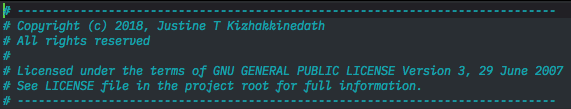
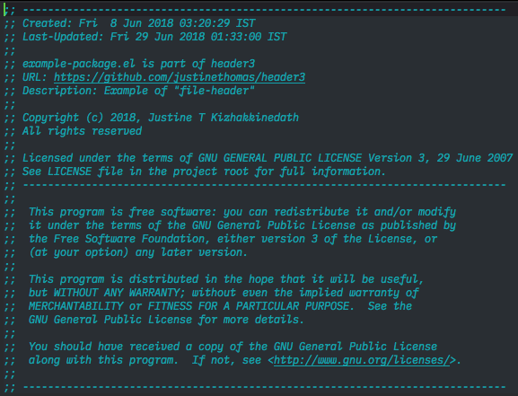
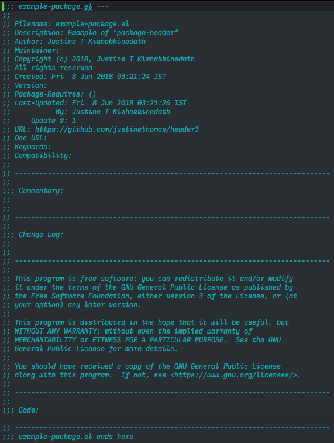
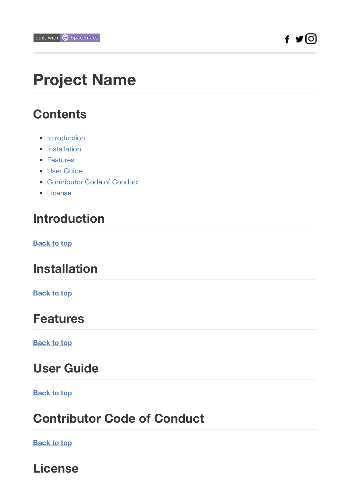
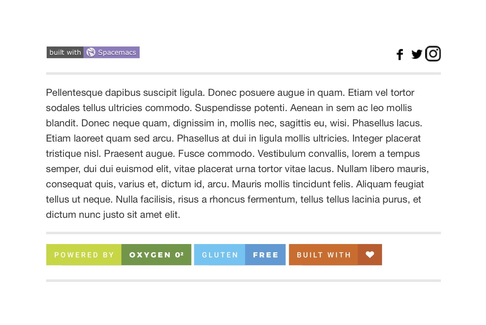

<a name="top"></a>
[](http://spacemacs.org)
<a href="https://www.instagram.com/justinekizhakkinedath"></a>
<a href="http://www.twitter.com/justinethomask"></a>
<a href="https://www.facebook.com/JustineKizhakkinedath"></a>
<br>
- - -
[](https://www.gnu.org/licenses/gpl-3.0)
[](https://github.com/justinethomas/header3/releases)
[](https://waffle.io/justinethomas/header3)

# Header3 for Emacs
Header3 is a package for Emacs which will help you to automatically add headers
to your source code files when you create a new one in Emacs.  
Header3 is built upon [header2.el](https://www.emacswiki.org/emacs/download/header2.el)
and adds more features to it, but I have made efforts to make it compatible with header2.

## Table of contents

<!-- toc -->

- [Types of headers](#types-of-headers)
  * [Mini Header](#mini-header)
  * [File Header](#file-header)
  * [Package Header](#package-header)
  * [Readme Header](#readme-header)
    + [Template for new file](#template-for-new-file)
    + [Template for existing file](#template-for-existing-file)
- [Features](#features)
- [Requirements](#requirements)
- [Installation](#installation)
- [How to use ?](#how-to-use-)
- [Working](#working)

<!-- tocstop -->

## Types of headers

### Mini Header
if you need the smallest header.


---

### File Header
if you need a little bigger headers.


---
### Package Header
if you need the biggest one.


---
### Readme Header

#### Template for new file
The following example is auto generated when you create a new Readme.md file
(file name is case insensitive)




------

#### Template for existing file
The following example is generated when you run `make-readme-header` and the file
already has some contents



---
*All examples are generated using Header3.*

## Features
* All Features of [header2.el](https://www.emacswiki.org/emacs/download/header2.el) plus
  * Standard header format.
  * Auto timestamp for file creation and file updating.
  * Automatic entry of the user name of last update and keeping track of update number.
  * Easy Customisation Interface available. Send bug reports within the interface.
  * Keep Commentary and Change Log inside the file.
* Automatically add git project link into the header
* Automatically add License to the files.
* Automatically add Readme template with random footer badges from
[For the Badge](https://forthebadge.com)

## Requirements
* [Git-link](https://github.com/sshaw/git-link) This package is used to extract
the git link of the current buffer.

* [Projectile](https://github.com/bbatsov/projectile) This package is the one
which will check your project directory and get its root path.  
Projectile provides us with project name and project path which is used to check
if the project root contains any License file.  
If it does then it checks the first 5 lines for any mention of "License" and
"Version" (case-insensitive).

Instructions to install these packages are available at their links.

## Installation
* `git clone https://github.com/justinethomas/header3 ~/.emacs.d/lisp/header3`
* Add these lines to your `.emacs` or your init file.
  ```
  (add-to-list 'load-path "~/.emacs.d/lisp/header3")
  (load "header3-launcher")
  ```

## How to use ?
* All new files created inside Emacs will automatically trigger a function that
will add the header.
* If you need to add header to an existing file execute using `M-x` and
  - `make-mini-header`
  - `make-file-header`
  - `make-package-header`
  - `make-readme-header`

## Working
* Files that are recognised as License files are
  - LICENSE
  - License
  - LICENSE.md
  - License.md
  - LICENSE.txt
  - License.txt
* License templates included with the package
  - [MIT License](https://opensource.org/licenses/MIT)
  - [Apache License](http://www.apache.org/licenses/LICENSE-2.0)
  - [Mozzila Public License](https://opensource.org/licenses/MPL-2.0)
  - [GNU AFFERO General Public License](https://www.gnu.org/licenses/agpl-3.0.en.html)
  - [GNU LESSER General Public License](https://www.gnu.org/licenses/lgpl.html)
  - [GNU General Public License Version 2](https://www.gnu.org/licenses/old-licenses/gpl-2.0.en.html)
  - [GNU General Public License Version 3](https://www.gnu.org/licenses/gpl-3.0.en.html)
* Default settings:
  - `file-header` is the default header for
    - C++
    - Clojure
    - Coffee script
    - Emacs lisp
    - Erlang
    - Haskell
    - Java
    - Kotlin
    - Python
    - Ruby
    - Rust
    - Scala
    - Scheme
    - Swift
  - `mini-header` for
    - PHP
    - Shell scripts
* Default settings are stored in `header3-launcher.el` file.

- - -
[](https://forthebadge.com)
[](https://forthebadge.com)
[](https://forthebadge.com)
- - -
