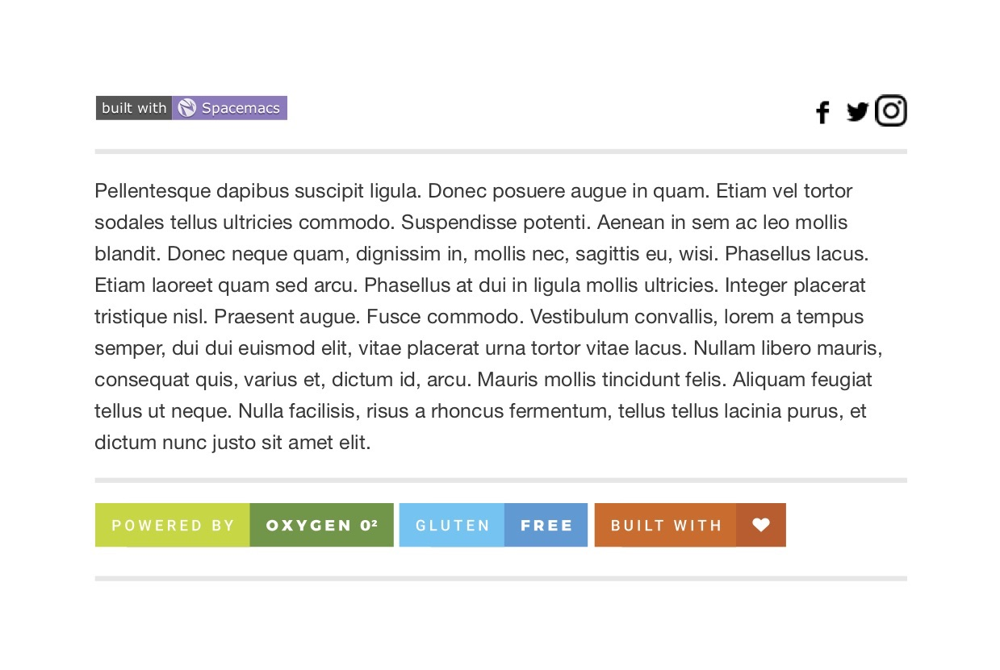
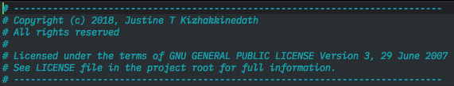
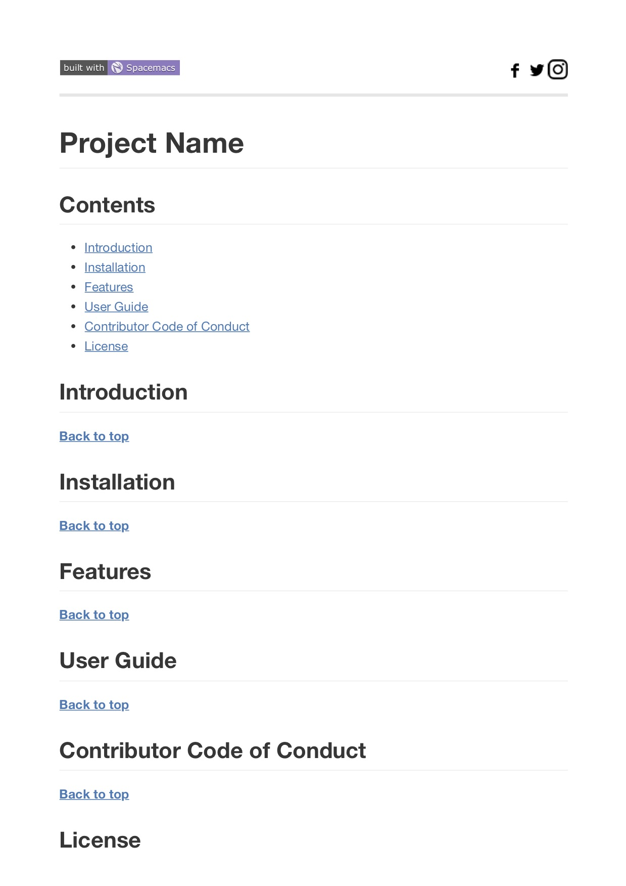

`Built with Spacemacs`_ - - - `License: GPL v3`_ `Development stage`_
`GitHub release`_ `Zube.io`_

Header3 for Emacs
=================

Header3 is a package for Emacs which will help you to automatically add
headers to your source code files when you create a new one in Emacs.
Header3 is built upon `header2.el`_ and adds more features to it, but I
have made efforts to make it compatible with header2.

Table of contents
-----------------

.. raw:: html

   <!-- toc -->

-  `Types of headers`_

   -  `Mini Header`_
   -  `File Header`_
   -  `Package Header`_
   -  `Readme Header`_

      -  `Template for new file`_
      -  `Template for existing file`_

-  `Features`_
-  `Requirements`_
-  `Installation`_
-  `How to use ?`_
-  `Working`_

.. raw:: html

   <!-- tocstop -->

Types of headers
----------------

Mini Header
~~~~~~~~~~~

if you need the smallest header.

|alt text|
----------

File Header
~~~~~~~~~~~

if you need a little bigger headers.

.. _alt-text-1:

|alt text|
----------

Package Header
~~~~~~~~~~~~~~

if you need the biggest one.

.. _alt-text-2:

|alt text|
----------

Readme Header
~~~~~~~~~~~~~

Template for new file
^^^^^^^^^^^^^^^^^^^^^

The following example is auto generated when you create a new Readme.md
file (file name is case insensitive)

|alt text| |alt text|

--------------

Template for existing file
^^^^^^^^^^^^^^^^^^^^^^^^^^

The following example is generated when you run ``make-readme-header``
and the file already has some contents

   alt text

--------------

*All examples are generated using Header3.*

Features
--------

-  All Features of `header2.el`_ plus

   -  Standard header format.
   -  Auto timestamp for file creation and file updating.
   -  Automatic entr

.. _Built with Spacemacs: http://spacemacs.org
.. _`License: GPL v3`: https://www.gnu.org/licenses/gpl-3.0
.. _Development stage: 
.. _GitHub release: https://github.com/justinethomas/header3/releases
.. _Zube.io: https://zube.io
.. _header2.el: https://www.emacswiki.org/emacs/download/header2.el
.. _Types of headers: #types-of-headers
.. _Mini Header: #mini-header
.. _File Header: #file-header
.. _Package Header: #package-header
.. _Readme Header: #readme-header
.. _Template for new file: #template-for-new-file
.. _Template for existing file: #template-for-existing-file
.. _Features: #features
.. _Requirements: #requirements
.. _Installation: #installation
.. _How to use ?: #how-to-use-
.. _Working: #working

.. |alt text| image:: resources/file_header.png
.. |alt text| image:: resources/package_header.png

